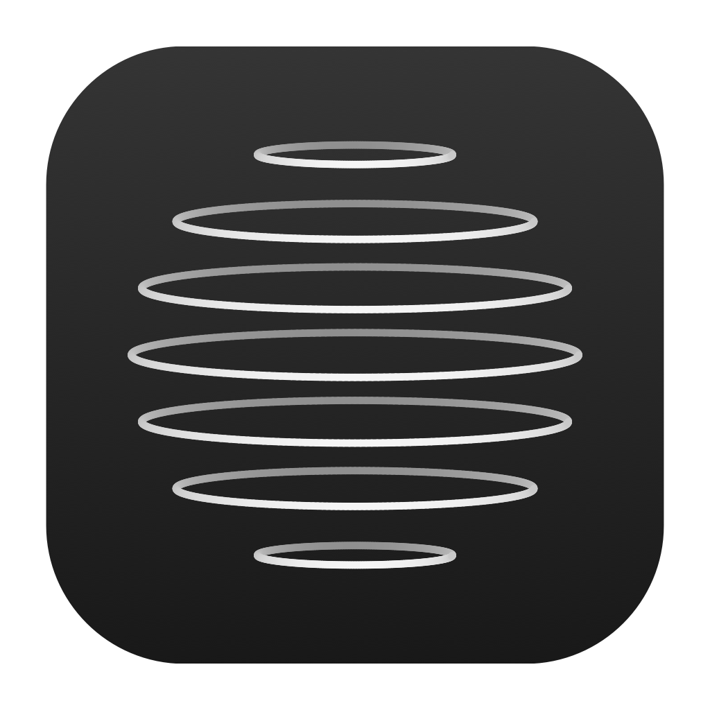

# Halo



A native SwiftUI + AppKit island for your Mac. Built and tested on **macOS 27.0.1, Apple Silicon, Swift 6.4**.

## Download

Get the **DMG or ZIP** from the [private GitHub releases](https://github.com/somealtmail-sudo/Halo/releases). Repository access and GitHub sign-in are required. Quit Halo before replacing it, drag `Halo.app` into Applications, then open it. The download includes the media helper; no terminal setup or separate dependencies are needed.

The current private beta is **ad-hoc signed, not Apple-notarized**. macOS may block a downloaded copy; this is not a Developer ID release. The [release guide](docs/RELEASING.md) documents the remaining signing requirements. Minimum deployment target: macOS 14.2 on Apple silicon; live runtime validation: macOS 27.0.1.

## Use

Halo lives in the menu bar and at the top of your display. Hover over the island to expand it; click the pin to keep it open. The menu bar icon opens settings or quits the app. **Settings → Size** adjusts the open and closed dimensions.

## Build locally

To install it in your user Applications folder after building, quit Halo and run `bash scripts/install.sh`. Updates verify and stage the new app before replacing an existing Halo installation, preserving the previous build as a backup.

```sh
bash scripts/build.sh
open dist/Halo.app
```

Requires Xcode with Swift 6 or later. There are no downloaded Swift package dependencies. The bundled media helper is compiled from the pinned source snapshot included in the repository. `python3 scripts/release.py` creates versioned ZIP/DMG downloads with SHA-256 checksums. See [releasing](docs/RELEASING.md).

## Included

- **System Now Playing:** Apple Music, Spotify, and browser/other players that publish a macOS media session. Shows artwork, title, artist, source, play/pause, previous/next and a seek bar when the player supplies the relevant information.
- **Other audio apps:** CoreAudio identifies processes with active output IO. These show an app-level activity card when no usable Now Playing session is available. Audio IO does not prove audible sound; some apps keep silent output streams open.
- **Optional direct fallback:** enable in Settings to query Music and Spotify through Automation when no system session is available. macOS asks for consent per application. This mode does not retrieve artwork.
- **Quiet interface:** a blank idle notch, neutral Music/Focus/Shelf controls, and no logo or slogans in the island. DynamicLake’s compact activities and hover controls informed the design.
- **Responsive hover:** immediate event-driven entry, a 180 ms exit grace period, and forgiving edge tracking. Hover opens the activity visible in the compact notch. Pinning keeps controls open.
- **Size controls:** automatic camera-cutout sizing or custom closed width/height, plus independent open width/height. Settings enforce enough room for the physical camera and controls.
- **Smooth motion:** top-anchored spring expansion, compact track announcements, artwork, and an animated playback indicator. System Reduce Motion and the app’s own preference suppress decorative animation. The bars are a playback indicator, not measured audio levels.
- **Focus:** 5-, 25- and 50-minute sessions with pause, resume, reset, and completion sound. Uses a wall-clock deadline so sleep/wake does not stretch the timer. Sessions last until the app quits.
- **Shelf:** up to 30 file/directory references, drag in/out, file picker, Finder reveal, and remove-from-shelf. Originals remain in their folders. Shelf paths persist across launches; moved files need to be added again.
- **Battery moments:** charging/discharging and low-battery announcements, checked every 30 seconds.
- **Display support:** uses the actual notch’s safe areas, supports a selected display, and shows an edge-attached notch on displays without a camera cutout. Joins desktop Spaces and permits fullscreen use. Repositions after display changes.
- **Settings:** launch at login, show/hide island, hover behavior, track peeks, reduced motion, battery moments, reconnect media, and a clearly labeled visual preview.

## Background resource use

Idle and paused views do not run a one-second display clock. Progress updates run only while visible; hidden views and sleeping displays stop decorative animation and hover polling. Focus completion uses a separate deadline, so hiding the notch does not stop a timer. CoreAudio fallback scans run off the main thread, without overlapping scans. Album artwork is decoded off the UI thread into a bounded thumbnail.

Media commands use a bounded queue and timeouts. Quit waits briefly for helper shutdown, including a stopped helper; launching a second normal copy reuses the existing app. Halo has no update poller, account service, analytics, or network backend. See [privacy](docs/PRIVACY.md) and [verification](docs/VERIFICATION.md).

## Media compatibility

macOS does not expose a stable public API for reading every other application’s track metadata. Halo bundles the BSD-licensed [MediaRemote Adapter](https://github.com/ungive/mediaremote-adapter) and runs it through the system Perl binary, following the upstream integration. This private API integration may need maintenance after macOS updates. CoreAudio activity detection remains separate from metadata/control support. No recording, microphone access, account login, server, telemetry, or network request is added by Halo.

The system chooses its current Now Playing session. Halo controls that session; it does not independently enumerate every browser tab or every app’s queue. Player limitations, ads, live streams, or missing metadata can limit seeking/skipping. Music and browser compatibility uses the shared system protocol; live verification completed so far is listed in [docs/VERIFICATION.md](docs/VERIFICATION.md).

If metadata is missing, first choose **Reconnect Media** in the menu. The optional direct-player fallback can help Music and Spotify. A generic activity card intentionally does not offer unsupported transport controls.

## Develop and verify

```sh
swift test
bash scripts/build.sh
python3 scripts/integration_test.py
dist/Halo.app/Contents/MacOS/Halo --diagnostics
```

Quit other Halo copies before integration tests. The script launches a silent local player and owned test app processes; it also exercises forced helper shutdown. Unit tests and downloadable packaging run in GitHub Actions. Live media integration needs a logged-in macOS session and is tested locally.

To sample a running app and its helper without collecting media information:

```sh
python3 scripts/profile.py --pid HALO_PID --seconds 30 --label idle
```

The adapter’s explicit compatibility test (it may briefly publish a synthetic session if nothing is playing):

```sh
APP="$PWD/dist/Halo.app/Contents"
/usr/bin/perl "$APP/Resources/mediaremote-adapter.pl" \
  "$APP/Frameworks/MediaRemoteAdapter.framework" \
  "$APP/MacOS/MediaRemoteAdapterTestClient" test
```

`scripts/browser-fixture.html` is a local silent-audio Media Session test page. Open it in a browser and click Play to validate that browser’s metadata and controls. Close the tab afterward. This fixture is not bundled in the app.

`open dist/Halo.app --args --preview` starts the explicitly labeled appearance preview; `--settings` opens settings on launch. Quit the current app before using startup arguments.

## Project map

| Location | Purpose |
|---|---|
| `Sources/Halo/MediaService.swift` | Media process lifecycle, transport, CoreAudio, opt-in Automation |
| `Sources/Halo/HaloApp.swift` | App lifecycle, menu bar, nonactivating panel, display and pointer behavior |
| `Sources/Halo/IslandView.swift` | Compact/expanded island, player, focus and shelf |
| `Sources/Halo/AppModel.swift` | Preferences, timers, shelf, battery and announcement state |
| `Sources/Halo/SettingsView.swift` | Preferences window and launch-at-login |
| `Sources/HaloCore` | Testable stream, timeline and timer logic |
| `scripts` | App bundling and packaging, icon, entitlements, browser fixture |
| `Vendor/mediaremote-adapter` | Pinned third-party source; license included in app |

See [research and design decisions](docs/RESEARCH.md) and [third-party notices](THIRD_PARTY_NOTICES.md).
